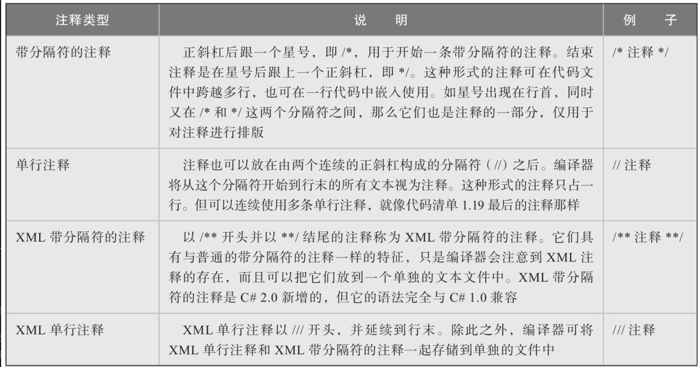

# 语法基础

1. **关键字**：具有特殊含义的单词。C#已经实现了关于这些单词的结构和使用方法。简单地说，C#将一些重要的功能进行了实现和封装，并以关键字对这些结构进行命名，方便程序员直接使用。


2. **标识符**：变量名，函数名等。程序员在编写代码时为元素赋予的名称。命名时应该注意[设计规范](addition/she-ji-gui-fan.md)。

如果希望用关键字作为标识符，需在关键字前面加上@前缀

```csharp
class @class {...}
```

@并不是标识符的一部分， 所以@myVariable和myVariable是一样的

**@前缀在调用使用其他拥有不同关键字的.NET语言编写的库时非常有用。**


3. **类型定义**：C#所有代码都出现一个一个类型定义的内部。类命名用PascalCase风格。


4. **Main方法**：C#程序从Main方法开始执行。C#要求Main方法返回void或int。要么无参数，要么接受一个字符串数组。

```csharp
static int Main(string[] args){...}
```

返回类型是int时，表示状态码，标识该程序是否执行成功。返回非0值通常意味着执行错误。


5. **语句和分隔符**：每条语句以分号结尾。空行、空白均不影响编译器编译C#语句。但利用空白可以让你的代码可读性更强。


6. **注释**：

<figure><figcaption><p>C#注释类型</p></figcaption></figure>

