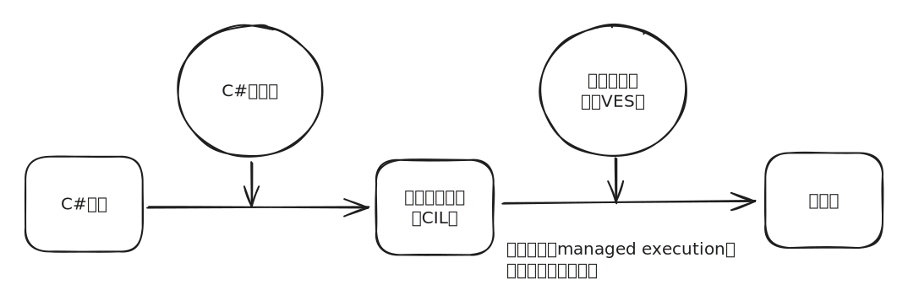

# 托管执行和CLI

VES（VirtualExecution System，虚拟执行系统）​。VES也称为运行时（runtime）​。它根据需要编译CIL代码，这个过程称为即时编译或JIT编译（just-in-time compilation）。

“运行时”规范包含在一个包容面更广的规范中，即CLI（Common LanguageInfrastructure，公共语言基础结构）规范，包含以下几个方面的规范：

* VES
* CIL
* 支持语言互操作行的系统，成为公共类型系统（Common Type System）。
* 编写通过CLI兼容语言访问的库的指导原则（这部分内容见公共语言规范（CommonLanguage Specification，CLS）​）​。
* 使各种服务能被CLI识别的元数据（包括程序集的布局或文件格式规范）​。

**VES为我们编写程序提供了极大的便利**，这也是为什么高级语言进一步解放了生产力的关键，程序员只需要写好程序代码，VES自动为我们提供了以下的服务：

* **语言互操作性**：不同源语言间的互操作性。语言编译器将每种源语言转换成相同中间语言（CIL）来实现这种互操作性。
* **类型安全**：检查类型间转换，确保兼容的类型才能相互转换。这有助于防范缓冲区溢出（这是产生安全隐患的主要原因）​。
* **代码访问安全性**：程序集开发者的代码有权在计算机上执行的证明。
* **垃圾回收**：一种内存管理机制，自动释放“运行时”为数据分配的空间。
* **平台可移植性**：同一程序集可在多种操作系统上运行。要实现这一点，一个显而易见的限制就是不能使用平台特有的库。所以平台依赖问题需单独解决。
* **BCL（基类库）**&#x200B;：提供开发者能（在所有.NET框架中）依赖的大型代码库，使其不必亲自写这些代码。

