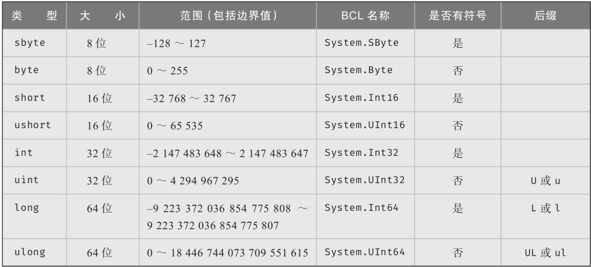
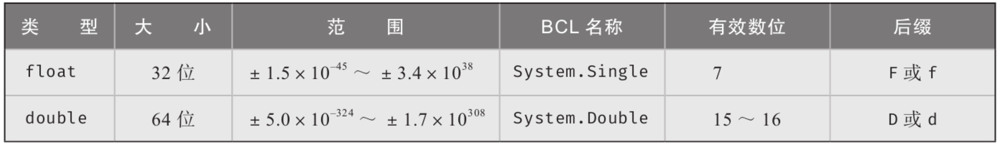

# 基本数值类型

整数类型C#的基本数值类型都有关键字与之关联，包括整数类型、浮点类型以及decimal类型。decimal是特殊的浮点类型，能存储大数字而无表示错误。

**整数类型：**

<figure><figcaption></figcaption></figure>

**浮点类型：**

<figure><figcaption>
浮点类型
</figcaption></figure>

decimal类型：

和浮点数不同，decimal类型保证范围内的所有十进制数都是精确的。

**字面值（literal value）**表示源代码中的固定值。

> 直接将值放到源代码中称为硬编码（hardcoding）​，因为以后若是更改了值，就必须重新编译代码。因为可能会为维护带来不便，所以开发者在硬编码值的时候必须慎重。
>
> 因此，可以考虑将值变为一个可传入值的变量，通过外部配置文件来传入不同的值。

