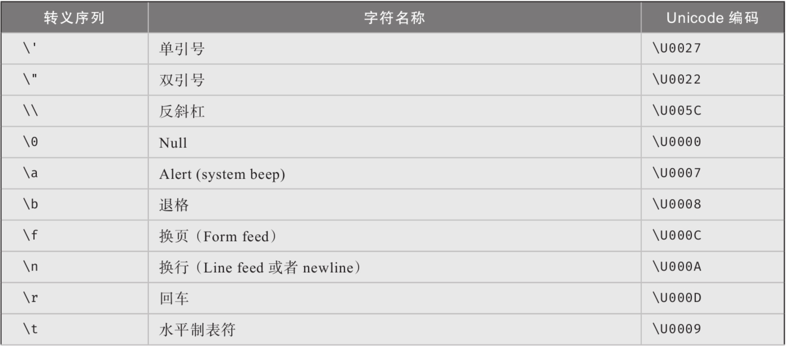

# 其他基本类型

**布尔类型**：小写的true或false。无法转化成整数，反之亦然。实际大小是一个字节。

**字符类型**：char标识16位字符，对应unicode字符集。用单引号。反斜杠（\）可以转义（escape）一些特殊字符。

<figure><figcaption>
转义字符
</figcaption></figure>

**字符串类型**：string，用双引号。允许使用逐字前缀@，允许用$前缀进行字符串插值。最后，string是一种“不可变”类型。

string的一些关键内容：静态方法、实例方法、属性、字符串格式化（通过一组覆盖面广且复杂的格式化模式组合来显示数字、日期、时间、时间段等）、不可变的特性（无法修改）。

